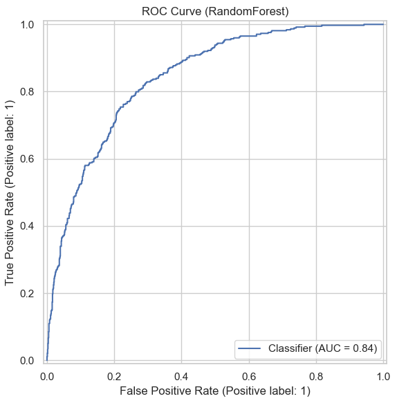
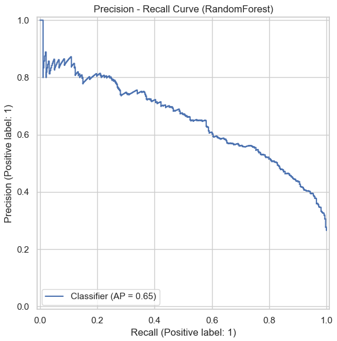
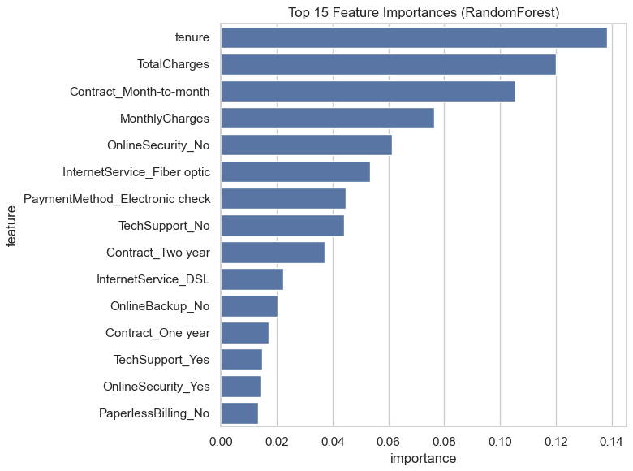

# Telco Customer Churn Prediction

End-to-end machine learning project predicting telecom customer churn using demographic, service, and billing data.

---

## Project Overview

Customer churn is a major challenge for subscription-based businesses such as telecom providers. Identifying customers likely to leave allows companies to take proactive retention actions.

This project builds a complete machine learning pipeline to predict customer churn. The workflow includes exploratory data analysis, data cleaning, preprocessing pipelines, baseline models, hyperparameter tuning, and model interpretation.

---

## Dataset

The dataset contains **7,043 telecom customers** with demographic information, subscribed services, and billing details.

**Target variable**

`Churn` (Yes / No)

**Class distribution**

* No churn: **73.5%**
* Churn: **26.5%**

After preprocessing the model uses:

* **3 numerical features**
* **16 categorical features**

---

## Methodology

The modeling workflow includes:

1. Exploratory Data Analysis (EDA)
2. Data cleaning (`TotalCharges` conversion and validation)
3. Feature preprocessing with **ColumnTransformer**
4. Stratified **train/test split**
5. Baseline models:

   * Dummy Classifier
   * Logistic Regression
6. **Random Forest with hyperparameter tuning** using `RandomizedSearchCV`
7. Model evaluation using ROC-AUC and PR-AUC

---

## Results

| Model                     | Accuracy | ROC-AUC | PR-AUC    |
| ------------------------- | -------- | ------- | --------- |
| **Random Forest (tuned)** | 0.802    | 0.842   | **0.653** |
| Logistic Regression       | 0.806    | 0.842   | 0.634     |
| Dummy Baseline            | 0.735    | 0.500   | 0.265     |

Random Forest achieved the best **PR-AUC**, which is an important metric for moderately imbalanced classification problems.

---

## Model Evaluation

### ROC Curve

### Precision-Recall Curve

---

## Feature Importance

The Random Forest model highlights the most important drivers of churn:

* **Tenure**
* **TotalCharges**
* **Contract type (Month-to-month)**
* **MonthlyCharges**
* **OnlineSecurity**
* **InternetService**

These results align with patterns observed during exploratory analysis.

---

## Tech Stack

* Python
* pandas
* numpy
* scikit-learn
* matplotlib
* seaborn

---

## Future Improvements

* Threshold tuning based on business costs
* Probability calibration
* Repeated cross-validation for model stability
* Production monitoring and retraining strategy

---

## Author

Thomas Pechlivanis
